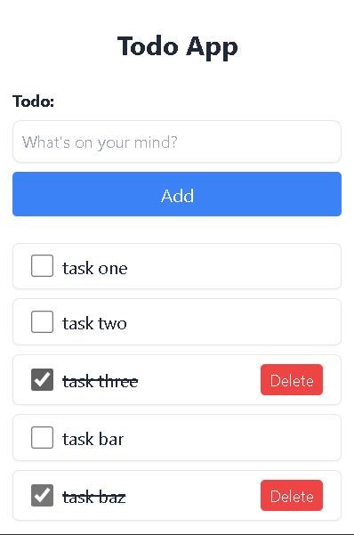

# Building a Todo App using SvelteKit Made Easy



Here we create an application with simple functionality of creating, reading, updating and deleting a completed task.

> Svelte is the most dreaded library as of 2022 .

## Creating a Svelte project

To initialise a Svelte project, run the command

```bash
# create a new project in the current directory
npm init svelte@next

# create a new project in my-app
npm init svelte@next todo-svelte-app
```

> Note: the `@next` is temporary version and will be updated in the future.

Allow eslint and prettier configuration while initialising the project.

## Adding & configuring Tailwind CSS

Install the packages required as dev-dependencies because they will only be used in development and also to build the css bundle for production

```bash
npm i -D tailwindcss@latest postcss@latest autoprefixer@latest
```

Create a **post.config.cjs** file in the root directory and set up with the following configuration

```js
module.exports = {
	plugins: {
		tailwindcss: {},
		autoprefixer: {}
	}
};
```

Next is to run the `npx tailwindcss init` initialise the tailwind.config.js file in the root directory and add the following configurations

```js
module.exports = {
	purge: ['./src/**/*.svelte', './src/**/*.css'],
	darkMode: false, // or 'media' or 'class'
	content: [],
	theme: {
		extend: {}
	},
	plugins: []
};
```

Create **app.css** file in the **src** directory and add the following configurations

```css
@tailwind base;
@tailwind components;
@tailwind utilities;
```

## Additional Libraries

We will install an additional library to create unique ids for our todos.

```bash
# Installs as a main dependency
npm install -S uuid
```

##

## Creating the app

##### Main Layout file

We need to create another file under ***src/routes*** directory called **__layout.svelte** and add the following code

```js
<script>
    // Importing the app.css
	import '../app.css';
</script>

<div class="container mx-auto my-6 max-w-lg">
	<slot />
</div>

```

##### Stores

Svelte frontend framework uses the idea of stores to maintain state throughout the app. So we'll create a **stores** directory and in it create a **todoStore.js** file and then add the following code:

```js
import { v4 } from 'uuid';
import { writable } from 'svelte/store';

export const todos = writable([]);

export const addTodo = (text) => {
	todos.update((cur) => {
		const newTodos = [...cur, { id: v4(), text, completed: false, createdAt: Date.now() }];
		return newTodos;
	});
};

export const deleteTodo = (id) => {
	todos.update((todos) => todos.filter((todo) => todo.id !== id));
};

export const completeTodo = (id) => {
	todos.update((todos) => {
		let index = -1;
		for (let i = 0; i < todos.length; i++) {
			if (todos[i].id === id) {
				index = i;
				break;
			}
		}
		if (index !== -1) {
			todos[index].completed = !todos[index].completed;
		}
		return todos;
	});
};

```

##### Components

Our app will have two components: one for the form and another for the unordered list component. Create another directory named **components** under **src** directory and add **TodoForm.svelte** and **Todo.svelte** files

In the **TodoForm.svelte** file add:

```svelte
<script>
	import { addTodo } from '../stores/todoStore.js';
	let todo = '';
	const handleSubmit = () => {
		// console.log('Submitting...');
		if (todo === '') {
			todo = '';
			return alert('Please enter a todo as required!');
		}
		addTodo(todo);
		todo = '';
	};
</script>

<form class="my-6 mx-3" on:submit|preventDefault={handleSubmit}>
	<div class="flex flex-col text-sm mb-2">
		<label for="todo" class="font-bold mb-2 text-gray-800">Todo:</label>
		<input
			type="text"
			name="todo"
			bind:value={todo}
			placeholder="What's on your mind?"
			class="appearance-none shadow-sm border border-gray-200 p-2 focus:outline-none focus:border-gray-500 rounded-lg"
		/>
	</div>
	<button
		type="submit"
		class="w-full shadow-sm rounded bg-blue-500 hover:bg-blue-600 text-white py-2 px-4">Add</button
	>
</form>

```

In the **Todo.svelte** file add:

```js
<script>
	import { deleteTodo, completeTodo } from '../stores/todoStore.js';
	export let todo;
</script>

<li
	class="bg-white flex items-center shadow-sm border border-gray-200 rounded-md my-2 mx-3 py-2 px-4"
>
	<input
		name="completed"
		type="checkbox"
		checked={todo.completed}
		on:change={() => completeTodo(todo.id)}
		class="mr-2 form-checkbox h-5 w-5"
	/>
	<span class={`flex-1 text-gray-800 ${todo.completed ? 'line-through' : ''}`}>{todo.text}</span>
	{#if todo.completed}
		<button
			type="button"
			class="text-sm bg-red-500 hover:bg-red-600 text-white py-1 px-2 rounded focus:outline-none focus:shadow-outline"
			on:click={() => deleteTodo(todo.id)}>Delete</button
		>
	{/if}
</li>

```

Our **index.svelte** should then be modified to:

```js
<script>
	import TodoForm from '../components/TodoForm.svelte';
	import Todo from '../components/Todo.svelte';
	import { todos } from '../stores/todoStore.js';
</script>

<main>
	<h1 class="text-2xl font-bold text-center text-gray-800 md:text-3xl">Todo App</h1>
	<TodoForm />
	{#each $todos as todo}
		<Todo {todo} index={todo.id} />
	{/each}
</main>

```

####

#### Running the project

To run the project, execute this command as from the script in the Node's package.json file; open the browser on http://localhost:3000 and _voila!_ you created your todo app using sveltekit.

```bash
npm run dev
```

## Conclusion

To wrap up this tutorial, I am linking the code in my GitHub [here]() for you to fork or clone. To expand on this I will create another part of this tutorial where we will add authentication with json web tokens (JWT) provided by another RESTful API with either Express, Flask or Django. Hit me up on my [Twitter](https://twitter.com/MikeTeddyOmondi) or [LinkedIn]([LinkedIn](https://www.linkedin.com/in/miketeddyomondi/)) to suggest what you would want to see next or comment below on this tutorial.

## References:

- James Q. Quick - [YouTube video](https://www.youtube.com/watch?v=YipaPr4Aex8).